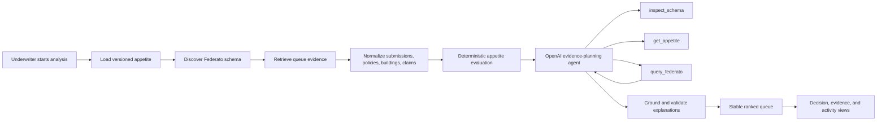

# UnderwriteIQ: Federato challenge alignment

## Bottom line

UnderwriteIQ meets the challenge's **Strong Solution** criteria and implements the main **Exceptional Solution** behaviors in demo mode:

- schema-first, model-authored Federato queries;
- adaptive follow-up queries based on returned evidence;
- deterministic appetite evaluation and stable ranking;
- evidence-grounded explanations for every submission;
- explicit missing-data and contradiction handling;
- an auditable tool trace and polished underwriting queue.

The live acceptance step is complete. UnderwriteIQ authenticated to Federato, discovered 12 runtime resources, loaded 158 submissions, executed model-authored evidence queries, and produced 158 grounded OpenAI explanations without a trace failure. Without credentials, the app still falls back to its representative demo schema and data. External enrichment is intentionally deferred because the challenge describes it as optional.

## What the agent is

UnderwriteIQ is a hybrid agent. It separates judgment that must be consistent from work that benefits from model reasoning:

1. The deterministic rule engine owns appetite classifications, target matches, missing-data outcomes, and ranking.
2. The OpenAI agent inspects the live schema and appetite, decides what evidence to request, constructs queries, adapts after results or validation errors, and writes plain-English explanations.
3. A grounding gate accepts an AI explanation only when it refers to a known submission and verified evidence identifiers. The model cannot change an appetite result.

This avoids two common failure modes: hardcoded query scripts that are not agentic, and an unconstrained model inventing underwriting decisions.

## End-to-end data flow

## How it gets data

### Live Federato mode

When Federato credentials are configured, the backend:

1. mints an OAuth token through `auth.product.federato.ai`;
2. calls the handler with `{"action":"schema"}`;
3. builds a runtime registry of resources, fields, types, and references;
4. queries discovered resources in pages of up to 100 records;
5. resolves only schema-declared relationships;
6. normalizes the results into submissions, policies, insureds, buildings, locations, and claims;
7. gives the same runtime schema to the OpenAI agent so its follow-up queries use actual fields instead of assumed ones.

The client refreshes its token before expiry and retries rate-limit or server failures with bounded backoff.

### Demo mode

Without Federato credentials, the app uses a representative seven-resource schema and 12 commercial-property submissions. The demo query sandbox executes the documented pipeline:

`where → expand → unwind → filter → over → select → sort → pagination`

It supports reference hydration, `$elemMatch`, grouping, and common reductions so the agent is still exercising realistic query behavior rather than reading a prewritten answer.

### Appetite data

Carrier appetite is not embedded in the prompt. It lives in a versioned JSON rule pack and is validated and reloaded at the start of every run. An approved appetite-file update changes the next analysis without changing Python code or restarting the server.

### External data

No external flood, climate, geocoding, or business-health service currently affects ranking. The UI shows COPE fields that exist in Federato evidence, but it does not claim optional enrichment occurred.

## What happens during one run

1. **Load appetite:** validate the active rule pack and record its version.
2. **Discover schema:** use live Federato schema or the demo fixture.
3. **Load evidence:** retrieve the queue and related policy/building/claim records.
4. **Evaluate every submission:** apply hard requirements before preferences.
5. **Create the base ranking:** status, target matches, evidence completeness, received date, then stable ID.
6. **Start the OpenAI tool loop:** the model must inspect schema and appetite and execute at least one query.
7. **Adapt:** query results and repairable errors return to the model. It can broaden, narrow, or deepen its next query.
8. **Force bounded completion:** the last permitted turn is reserved for a strict structured report.
9. **Ground the report:** reject unknown submissions or unsupported evidence IDs.
10. **Present the result:** show ranked decisions, source evidence, contradictions, requested follow-up information, query adaptations, and the activity trace.

## Tools available to the model

### `inspect_schema`

Returns the runtime resources, fields, types, reference targets, cardinalities, pipeline order, and exact query-shape examples. The model must call this before it finishes.

### `get_appetite`

Returns the active appetite ID, version, effective date, requirements, preferences, operators, and thresholds. Hard requirements are explicitly authoritative.

### `query_federato`

Accepts a concise underwriting purpose plus model-authored query JSON. Before execution, the backend rejects unknown resources, hallucinated fields, unsupported operators, malformed expansion/unwind/sort stages, and unbounded pagination. Valid queries run against live Federato or the demo query sandbox.

## Appetite scoring and ranking

UnderwriteIQ does not invent a pseudo-actuarial 87/100 score. It exposes a transparent rules-based result:

- **Target:** every hard requirement passes and all four target preferences match.
- **Acceptable:** every hard requirement passes, but not every target preference matches.
- **Needs review:** missing, contradictory, or boundary evidence prevents a reliable decision and no hard failure is proven.
- **Out of appetite:** at least one hard requirement fails. Preferences cannot compensate for that failure.

Within those categories, ranking uses:

1. category priority;
2. number of target preferences matched;
3. evidence completeness;
4. received date;
5. stable submission ID.

The visible `4/4` value is the calculated appetite-fit score required by the challenge, not an unsupported risk probability.

## What is dynamic and what is configured

Dynamic at runtime:

- Federato resources, fields, types, and relationships;
- the model's query resource, filters, expansions, projections, grouping, and pagination;
- whether the agent runs a focused follow-up query;
- explanations, contradiction summaries, and follow-up requests;
- the number and order of records returned by Federato.

Configured, but not buried in code:

- carrier appetite requirements and preferences;
- model name, reasoning effort, turn limit, and query-call limit;
- Federato and OpenAI credentials.

Intentionally deterministic:

- rule outcomes;
- appetite classification;
- target-match count;
- evidence completeness;
- final queue ordering.

## Challenge requirement matrix

| Guideline | UnderwriteIQ implementation | Status |
| --- | --- | --- |
| Query the API | OAuth client, schema action, query action, pagination and retries | Live verified |
| Discover data shape | Runtime `SchemaRegistry`; schema inspection is mandatory for the model | Implemented |
| Dynamic queries | OpenAI authors query JSON from runtime schema and appetite | Implemented |
| Adapt from results | Tool results return to the model; final verified run deepened into claims for unresolved loss data | Implemented |
| Score appetite | Hard requirements plus a visible four-preference match count | Implemented |
| Rank queue | Stable deterministic multi-factor ordering | Implemented |
| Explain every result | Strict structured report; one grounded explanation per assessment | Implemented |
| Handle missing data | `needs_review`, evidence completeness, explicit follow-up requests | Implemented |
| Handle contradictions | Deterministic conflict flag plus model contradiction summary | Implemented |
| Trace reasoning | Query purposes, selected fields, duration, result summary, failures, and adaptations | Implemented |
| Polished UI | Filterable ranked queue, details, evidence table, COPE view, activity trace | Implemented |
| Handle 50+ | Pagination to 1,000 records, a 60-record test, and a 158-record live run | Live verified |
| External enrichment | Optional per challenge | Deferred |

## Safety and failure behavior

- The OpenAI key stays server-side and `.env` is ignored by Git.
- Raw private chain-of-thought is never requested or displayed; the UI shows concise query purposes and summaries.
- Tool calls and output are bounded.
- OpenAI responses use a strict JSON schema.
- Invalid queries are rejected before Federato execution and can be repaired by the model.
- Unsupported explanation evidence is rejected.
- An OpenAI outage or invalid report preserves deterministic decisions and explanations.
- The product prioritizes human review; it does not approve, reject, quote, price, or bind coverage.

## Current proof

- The automated suite covers rule precedence, boundary cases, schema validation, dynamic tool use, query repair, fallback, grounding, ranking, API behavior, and a 60-record queue.
- Federato OAuth, schema discovery, and querying were verified against 12 runtime resources and 158 submissions.
- A live OpenAI full-queue run produced 158 of 158 grounded explanations.
- The agent issued two schema-grounded Federato queries; both succeeded with no repair or trace failure.
- The deterministic result was 155 out-of-appetite submissions and 3 needing review because the five-year loss test was unresolved.

## Honest limitations

- Live field normalization uses schema-aware traversal plus conservative semantic aliases; it has been verified against the organizer schema, but new schema versions should be regression-tested.
- A full 158-explanation OpenAI run can take several minutes; deterministic ranking remains available immediately if OpenAI falls back.
- Runs and traces are held in memory and reset on backend restart.
- The synchronous workflow is appropriate for the hackathon dataset, not yet a production job queue.
- External enrichment and portfolio-accumulation analysis are sensible future work, not current capabilities.

## Judge-ready explanation

> UnderwriteIQ separates underwriting policy from AI reasoning. The carrier appetite is a versioned deterministic rule pack, so the model cannot invent or override decisions. The OpenAI agent first inspects Federato's runtime schema and the active appetite, then constructs its own evidence queries. Results come back into the same tool loop, letting it deepen the investigation when it sees missing or contradictory evidence. Every explanation is schema-constrained and accepted only when it cites known submission evidence. The dashboard then shows the ranked queue, exact rules, source records, missing information, and a safe audit trace of what the agent requested and why.

## Key implementation files

- Agent tool loop and grounding: `backend/app/agent.py`
- Federato OAuth/query client: `backend/app/federato_client.py`
- Runtime schema validation: `backend/app/schema_registry.py`
- Live evidence loading: `backend/app/live_data.py`
- Appetite rule engine: `backend/app/rule_engine.py`
- Classification and ranking: `backend/app/evaluator.py`
- Versioned appetite: `backend/appetite/commercial-property-2025.json`
- Underwriter dashboard: `frontend/app/dashboard.tsx`
