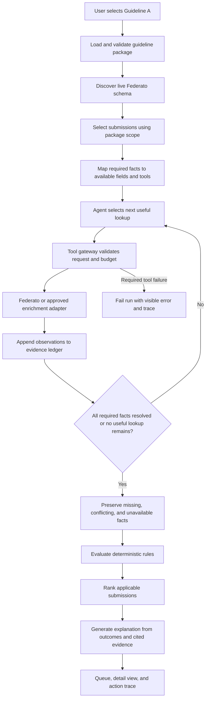

# Guidance-Agnostic Underwriting Harness Plan

## Outcome

Replace the property-specific workflow with a harness that runs any versioned guideline package against the live Federato queue.

The first package is named **Guideline A**. It contains the supplied 2025 commercial-property appetite. The harness must not contain property, COPE, or Guideline A decisions in shared orchestration code.

The final acceptance run uses the real Federato and OpenAI services across the complete live queue. Mock results do not satisfy final acceptance.

## Confirmed live baseline

The read-only Federato smoke check on 2026-09-19 returned:

- 12 schema resources;
- 158 submissions;
- 38 `property`, 20 `auto`, 21 `cgl`, 18 `cyber`, 15 `excess`, 36 `health`, and 10 `lpl` submissions;
- no Federato resource that stores carrier appetite or underwriting guidelines.

Federato is the source for submissions and evidence. Guideline packages are separate versioned inputs.

## Core concepts

### Guideline package

A guideline package is the deterministic decision contract selected in the UI. It contains:

- stable ID, display name, version, effective dates, and source;
- a scope predicate that identifies applicable submissions;
- required facts and sufficiency conditions;
- hard requirements, preferences, operators, thresholds, and ambiguity rules;
- ranking rules and deterministic tie breakers;
- an optional investigation-profile ID;
- allowed tool classes and evidence-source policies.

Shared code reads this contract. Shared code does not branch on a specific guideline ID or insurance line.

### Investigation profile

An investigation profile guides evidence collection. It can be packaged as an agent skill or equivalent versioned reference. It contains evidence domains, useful follow-up questions, source guidance, and tool suggestions.

It does not contain hidden carrier thresholds. It cannot change deterministic rule outcomes.

### Evidence ledger

The ledger is the only input to deterministic evaluation. Every fact records:

- canonical fact ID and value;
- source system, resource, record ID, and field path;
- source date and retrieval time when available;
- guideline requirement IDs that consume the fact;
- confidence state: `verified`, `missing`, `conflicting`, `ambiguous`, or `unavailable`;
- conflicting observations without destructive merging.

### Tool adapter

Every data source implements one gateway contract. The gateway validates arguments, enforces per-run budgets and timeouts, records a trace, and normalizes returned observations into the ledger.

Federato is the required first adapter. Enrichment adapters remain disabled until a provider and credentials are configured.

## Runtime flow



OpenAI failure, invalid structured output, timeout, or required-tool failure fails the run. There is no silent deterministic fallback in this phase.

## UI shape

```text
<UnderwritingWorkspace>
  <GuidelineSelector>
    Guideline A · Commercial property · v2025.1
    Scope: property · 38 of 158 submissions
  <RunControls>
    Run selected guideline
    Live Federato / OpenAI status
  <RunProgress>
    Discovering → Gathering evidence → Evaluating → Ranking → Explaining
  <RankedQueue>
    Applicable submissions only
    Status, preference matches, evidence coverage, guideline version
  <SubmissionDrawer>
    Decision
      Exact requirement and preference outcomes
    Evidence ledger
      Facts, sources, dates, conflicts, and unavailable states
    Agent activity
      Query purpose, adapter, result summary, budget, and errors
  <GuidelineLibrary>
    Installed packages and versions
    Scope and source documents
    Investigation profile and enabled tools
```

Submissions outside the selected package scope are **not applicable**. They are not `out_of_appetite` and not `needs_review`.

## Guidance library

These sources seed investigation profiles. They are reference guidance, not carrier acceptance rules.

| Federato code | Initial profile | Primary or industry source |
| --- | --- | --- |
| `property` | COPE: construction, occupancy, protection, exposure | [IRMI COPE definition](https://www.irmi.com/term/insurance-definitions/construction-occupancy-protection-and-exposure) |
| `auto` | Drivers, vehicles, use, territory, safety controls, and losses | [FMCSA Safety Management Cycle resources](https://csa.fmcsa.dot.gov/HelpCenter/Resources.aspx?kID=BASIC&type=keyword) and [Unsafe Driving SMC](https://csa.fmcsa.dot.gov/documents/fmc_csa_12_019_unsafedriv_smc.pdf) |
| `cyber` | Govern, identify, protect, detect, respond, recover | [NIST Cybersecurity Framework 2.0](https://www.nist.gov/cyberframework) and [NIST SP 1299](https://nvlpubs.nist.gov/nistpubs/SpecialPublications/NIST.SP.1299.pdf) |
| `cgl` | Premises, operations, products, completed operations, contracts, and loss history | [Chubb General Liability exposure guide](https://www.chubb.com/content/dam/chubb-sites/chubb-com/microsites/construction-risk-engineering-portal/resource-guides/documents/pdf/general-liability-exposures-resource-guide.pdf) and [proposal form](https://www.chubb.com/content/dam/chubb-sites/chubb-com/au-en/business/broadform-liability-insurance/documents/pdf/general-liability-proposal-form.pdf) |
| `lpl` | Practice areas, clients, conflicts, engagement controls, claims, and lawyer profile | [CNA Lawyers Professional Liability](https://www.cna.com/industries/affinity/lawyers) and [risk-control summary](https://www.cna.com/sites/default/files/assets/40afc934-0a94-4ebe-9d21-d2aa72874179/CNA-Lawyers-Professional-Liability-Risk-Control-Sell-Sheet.pdf?fid=) |
| `health` | Services, patient volume, staffing, facilities, clinical controls, incidents, and claims | [CNA hospital professional-liability application](https://www.cna.com/sites/default/files/assets/d35f7d66-e343-47cc-9828-89cc5581cb1b/HealthAppHospitalPLGLU_CNA.pdf) |
| `excess` | Underlying policies, limits, attachment, retained limits, exposure aggregation, and loss severity | [Chubb umbrella guideline and application index](https://www.chubb.com/us-en/business-insurance/chubb-express-umbrella-producer-guidelines-applications.html) |

Carrier-specific applications are examples of evidence questions. Their questions must not become universal acceptance thresholds.

## Implementation plan

### 1. Define the generic contracts

- Replace `AppetitePack` with a neutral `GuidelinePackage` contract, or preserve the internal name while exposing guideline language at the API boundary.
- Add scope, required-fact, sufficiency, ranking, profile, and tool-policy schemas.
- Extend evidence with provenance, observation time, source date, state, and conflicts.
- Add `not_applicable` only to selection summaries, not to appetite outcomes.

Complete when Guideline A validates through the generic schema and no shared model mentions property-specific facts.

### 2. Add the guideline and profile registries

- Move Guideline A into `backend/guidelines/guideline-a/`.
- Resolve packages by ID and version.
- Resolve investigation profiles independently from packages.
- Validate effective dates and reject ambiguous package selection.

Complete when the API can list packages, inspect one package, and resolve Guideline A without using a hard-coded default.

### 3. Separate schema discovery from evidence acquisition

- Keep the live Federato schema authoritative for fields and relationships.
- Replace the fixed seven-resource loader with on-demand, schema-grounded query execution.
- Build an explicit fact-to-source plan for the selected package.
- Record unmapped facts before the query loop begins.

Complete when every required Guideline A fact is mapped, explicitly unmapped, or marked unsupported by the live schema.

### 4. Put the agent loop before evaluation

- Give the agent the selected package, investigation profile, live schema digest, ledger state, and remaining budget.
- Require each query to name the unresolved fact IDs it can resolve.
- Normalize successful results into the ledger.
- Recompute sufficiency after each tool response.
- Stop when all required facts are resolved, no useful lookup exists, or the budget is exhausted.

Complete when a fact found by an agent-selected query changes the later deterministic outcome and is visible in the ledger and trace.

### 5. Generalize deterministic evaluation and ranking

- Resolve rules through canonical fact IDs.
- Apply package-defined requirements, preferences, ambiguity states, and tie breakers.
- Evaluate only submissions inside the package scope.
- Keep missing and conflicting required facts unresolved.

Complete when shared evaluation code has no property rule IDs, property field formatting, COPE categories, or fixed status ordering outside package configuration.

### 6. Add the tool gateway

- Register the Federato adapter through the same interface used by future enrichments.
- Enforce schemas, read-only operations, timeouts, retries, budgets, and trace events centrally.
- Fail the run when OpenAI or a required adapter fails.
- Allow optional adapters to return `unavailable` only when the package declares that behavior.

Complete when direct agent access to `FederatoClient` is removed and every lookup passes through the gateway.

### 7. Make the UI guideline-agnostic

- Add the guideline library and run selector.
- Replace property headings and COPE-only components with package/profile metadata.
- Render generic rule outcomes and generic facts.
- Show progress and fatal failures as persistent run states.
- Keep a profile-specific panel behind a renderer registry when it improves comprehension.

Complete when the UI can render a second fixture package without changing dashboard components. This fixture verifies generic rendering; it is not accepted as live validation.

### 8. Migrate Guideline A

- Preserve the supplied 2025 property rules, boundary ambiguities, and ranking behavior.
- Attach the property COPE profile.
- Compare current and migrated property outcomes before removing the old path.

Complete when all 38 live property submissions run through the new harness and every changed outcome has an explained migration reason.

### 9. Run live acceptance

- Use configured Federato and OpenAI credentials.
- Discover the schema at run time.
- Load all 158 live submissions.
- Run Guideline A against its 38 applicable property submissions.
- Confirm that no demo data, `query_demo`, scripted transport, or mock response contributes to the run.
- Confirm every assessment cites its guideline version, rule IDs, and ledger evidence.
- Confirm every query is schema-valid and every tool action appears in the trace.
- Record total duration, OpenAI model, tool-call counts, failures, unresolved facts, and final status counts.

Complete only when the live run finishes successfully and its stored trace supports every reported result.

## Proposed file shape

```text
backend/
├── guidelines/
│   └── guideline-a/
│       ├── package.json          # scope, facts, rules, ranking, tool policy
│       └── README.md             # human-readable source and assumptions
├── profiles/
│   ├── property-cope/
│   ├── commercial-auto/
│   ├── cyber-nist-csf/
│   ├── general-liability/
│   ├── lawyers-professional/
│   ├── healthcare-liability/
│   └── excess-liability/
└── app/
    ├── guideline_registry.py
    ├── profile_registry.py
    ├── evidence_ledger.py
    ├── fact_mapper.py
    ├── tool_gateway.py
    ├── adapters/
    │   └── federato.py
    ├── agent.py
    ├── evaluator.py
    └── service.py
```

Profiles can later become installed agent skills. The registry contract must not depend on that packaging choice.

## Clarifications before implementation

1. Should a run always evaluate one explicitly selected guideline, as recommended, or automatically choose one package for every submission?
2. Should the UI label the supplied property package exactly `Guideline A`, or use `Guideline A — 2025 Commercial Property`?
3. The repository currently instructs agents not to write backend tests. Should that instruction remain, with the live run and existing suite as the verification gates?
4. Which enrichment providers should be enabled first? Public guidance documents are not query APIs, so each enrichment adapter still needs a provider endpoint and credentials.
