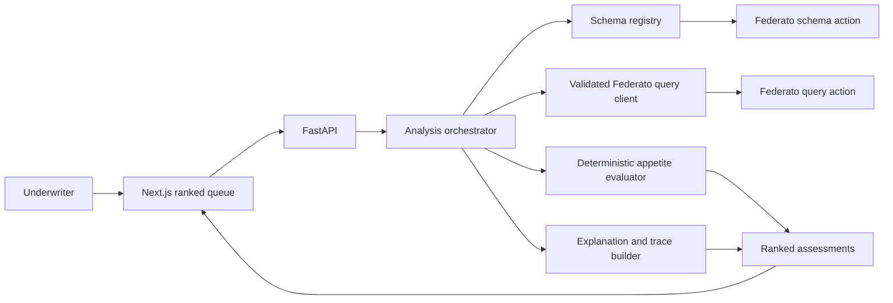

# UnderwriteIQ - Federato-Only MVP

## 1. Decision summary

UnderwriteIQ is an underwriting-triage agent for Federato's Hack the North 2026 challenge. It answers one question:

> Which commercial property submissions should an underwriter review first, and why?

The MVP will integrate only with Federato. It will discover the live Federato schema, retrieve the evidence required by the supplied 2025 appetite guidelines, classify and rank submissions, and show an auditable explanation for every result.

Baseten fine-tuning, custom-model deployment, model cost benchmarking, and external risk enrichment are later phases. The code should leave a clean model-provider seam, but none of those items should delay a working Federato demo.

## 2. What changes from the current project brief

The longer project brief is a useful north-star document, but it is too large for the first working version and contains assumptions that should be corrected against the official challenge packet.

| Current idea | Change for this MVP | Reason |
| --- | --- | --- |
| External risk enrichment is required | Defer it | Federato explicitly describes enrichment as an optional bonus. |
| Baseten training and benchmarking shape the product | Defer them to Phase 2 | The working underwriting agent is the primary product and demo. |
| A generic `FEDERATO_API_KEY` authenticates requests | Use OAuth client credentials | Federato provides a `client_id` and `client_secret`; tokens last four hours. |
| Federato exposes several REST endpoints | Use one handler with `schema` and `query` actions | This is the API contract in the supplied documentation. |
| Resource names, fields, and relationships are known in advance | Treat the live schema response as authoritative | The challenge intentionally requires schema discovery. Examples in the brief must not become hard-coded field assumptions. |
| A large autonomous LLM loop is required | Use one bounded schema-aware planner plus deterministic evaluation | Federato accepts templating, rules, or an LLM. Reliability and explainability matter more than agent complexity. |
| A full evaluation dashboard and at least ten gold cases are MVP requirements | Keep focused rule and integration tests; add the benchmark later | A working end-to-end submission flow is the immediate priority. |
| Many backend routes are required | Ship the smallest routes needed for the demo | This keeps the hackathon build focused. |
| Four statuses are Federato's required labels | Keep them as an UnderwriteIQ product choice | Federato requires scoring, ranking, and explanations, but does not mandate these exact labels. |

## 3. MVP scope

### In scope

- Authenticate with Federato using OAuth client credentials.
- Call schema discovery and cache the result for the current run.
- Validate every field and relationship used in a query against the discovered schema.
- Query submissions and follow the discovered relationships needed to obtain policy, exposure, building, location, and claim evidence.
- Apply the supplied 2025 commercial property appetite guidelines in deterministic code.
- Surface missing, ambiguous, conflicting, malformed, and unavailable data honestly.
- Rank the submission queue and explain each result using cited evidence and named rules.
- Show a compact activity trace: schema lookup, queries made, query purpose, result summary, latency, and errors.
- Provide a responsive ranked queue and a submission-detail view.
- Include focused tests for the rule engine, schema/query validation, ranking, and one mocked end-to-end flow.

### Out of scope

- Policy approval, rejection, pricing, quoting, or binding.
- A complete underwriting workbench or claims workflow.
- External hazard, climate, geocoding, or business-health APIs.
- Portfolio accumulation analysis unless the discovered data makes it trivial.
- Baseten fine-tuning or deployment.
- Frontier-versus-small-model cost and quality benchmarking.
- A dedicated evaluation dashboard.
- Multiple autonomous agents.
- Displaying private model reasoning or chain-of-thought.

## 4. User and product promise

The primary user is a commercial property underwriter with more incoming submissions than they can review in depth.

The MVP promise is:

> In one click, turn the Federato submission queue into a prioritized list that shows appetite fit, unresolved information, the evidence checked, and the next recommended action.

UnderwriteIQ is a triage tool. `target` or `acceptable` never means that coverage has been approved.

## 5. Core user flow

1. The underwriter opens the dashboard.
2. The app loads the available Federato submissions.
3. The underwriter selects **Analyze queue**.
4. UnderwriteIQ discovers the Federato schema and maps appetite rules to valid fields and relationships.
5. It retrieves the necessary evidence in bounded, validated queries.
6. Deterministic code evaluates hard requirements before target preferences.
7. The queue is ranked and displays status, score, confidence/completeness, and a one-line reason.
8. Selecting a row opens the rule breakdown, source evidence, missing information, next action, and activity trace.

## 6. Classification and scoring

The four labels below are an UnderwriteIQ interface convention:

- `target`: all hard requirements pass and all four documented target preferences match.
- `acceptable`: all hard requirements pass but fewer than four target preferences match.
- `needs_review`: no verified hard failure exists, but a required fact is missing, conflicting, ambiguous, or could not be retrieved.
- `out_of_appetite`: at least one explicit hard requirement fails.

Evaluation order is strict:

```text
explicit hard failure -> out_of_appetite
otherwise unresolved required evidence -> needs_review
otherwise all target preferences matched -> target
otherwise -> acceptable
```

A hard failure can never be offset by target-preference matches. A target match of zero means only that no additional target preference matched; it does not mean the submission is out of appetite.

### MVP appetite matrix

The supplied guideline contains four target preferences. The MVP shows the number matched, such as `3/4`, without inventing a weighted risk score.

| Factor | Hard requirement | Target preference | Evidence needed | Missing behavior |
| --- | --- | --- | --- | --- |
| Submission type | Must be new business; renewal is out | None | Submission or policy business type | `needs_review` |
| Line of business | Must be property | None | Policy line of business | `needs_review` |
| Primary risk state | Must be one of OH, PA, MD, CO, CA, FL, NC, SC, GA, VA, UT | OH, PA, MD, CO, CA, or FL | Primary location/state | `needs_review` |
| TIV | Must be at most $150M | $50M-$100M | Total insured value | `needs_review` |
| Total premium | Must be $50K-$175K | $75K-$100K | Policy premium | `needs_review` |
| Building age | Must be newer than 1990 | Newer than 2010 | Year built for relevant buildings | `needs_review` |
| Construction | More than 50% must be joisted masonry, non-combustible/steel, or masonry non-combustible | None | Construction type and an aggregation basis | `needs_review` |
| Five-year loss value | Must be under $100K | None | Claims and loss dates/values for the prior five years | `needs_review` |

The guide also lists account name and policy effective/expiration dates as required data points. They are context and completeness fields rather than independent appetite rules. Missing dates become decision-blocking when they prevent selection of the relevant policy or calculation of the five-year loss window.

### Explicit rule assumptions to confirm

The official table leaves a few boundaries and aggregation details unspecified. Until an organizer clarifies them, the MVP must expose these as named assumptions rather than silently guessing:

- `$50M-$100M`, `$75K-$100K`, and the maximum acceptable amounts are treated as inclusive.
- A building constructed exactly in 1990 is `needs_review`, because the guide defines only "newer than 1990" and "older than 1990."
- A five-year loss value exactly equal to $100,000 is `needs_review`, because the guide defines only "under" and "over."
- For multiple buildings, the oldest relevant building controls the building-age requirement and target preference. This is conservative and must be labeled as an UnderwriteIQ assumption.
- A construction mix exactly at 50% is `needs_review`, because the guide describes only proportions greater than 50%.
- The construction denominator is not defined. Use TIV-weighted share if the discovered schema provides the necessary per-building values; otherwise use building count and label that choice. If neither calculation is defensible, return `needs_review`.
- Five-year loss value means the sum of applicable claim loss values whose loss dates fall within the five years preceding the analysis date. The exact claim field names must come from schema discovery.

## 7. Ranking

Rank statuses in this order:

1. `target`
2. `acceptable`
3. `needs_review`
4. `out_of_appetite`

Within a status, rank by:

1. More target preferences matched.
2. Higher evidence completeness.
3. Earlier received date, if available.
4. Stable submission ID ordering.

Do not assume that higher premium is automatically better. Premium is evaluated only against the documented acceptable and target ranges.

## 8. Federato integration contract

### Authentication

- Token URL: `https://auth.product.federato.ai/oauth/token`
- Grant: `client_credentials`
- Audience: `https://product.federato.ai/core-api`
- Token lifetime: four hours
- Cache the token server-side and refresh it before expiry.
- Never send credentials or access tokens to the browser, logs, traces, or committed files.

### Data endpoint

Use:

```text
POST https://product.federato.ai/integrations-api/handlers/federato-hack-north?outputOnly=true
```

Federato exposes two actions through this handler:

```json
{ "action": "schema" }
```

```json
{
  "action": "query",
  "payload": {
    "resource": "Policy",
    "pagination": { "limit": 5 }
  }
}
```

The query payload may contain `resource`, `where`, `expand`, `unwind`, `filter`, `over`, `select`, `sort`, and `pagination`. The implementation must respect the documented pipeline order. Array predicates use `$elemMatch`; reference data must be expanded before downstream filtering or selection.

### Configuration

Create a root `.env.example` with no secrets:

```dotenv
FEDERATO_CLIENT_ID=
FEDERATO_CLIENT_SECRET=
FEDERATO_AUTH_URL=https://auth.product.federato.ai/oauth/token
FEDERATO_AUDIENCE=https://product.federato.ai/core-api
FEDERATO_HANDLER_URL=https://product.federato.ai/integrations-api/handlers/federato-hack-north?outputOnly=true
MODEL_API_BASE_URL=
MODEL_API_KEY=
MODEL_NAME=
```

The model variables are optional for a deterministic or mocked local flow. They preserve a provider boundary for later model experiments without adding Baseten work to this phase.

## 9. Technical design

Keep the existing Next.js frontend and FastAPI/Python backend.



### Backend responsibilities

- `federato_client`: token caching, timeouts, bounded retry for transient failures, and the two Federato actions.
- `schema_registry`: parse resources, nested fields, references, cardinality, and validate planned queries.
- `planner`: determine the evidence required by each rule and construct schema-valid queries. It may use templates, an LLM, or both, but must be bounded and observable.
- `normalizer`: turn Federato records into a small internal evidence model without losing source resource, record ID, field path, or raw value.
- `evaluator`: hard requirements, missing-data handling, target points, status, and stable ranking.
- `explanations`: generate concise explanations only from verified rule outcomes and retrieved evidence.
- `tracing`: record action summaries and tool evidence, not private chain-of-thought.
- `api`: expose the minimum frontend contract.

Suggested MVP routes:

- `GET /api/health`
- `GET /api/schema/status`
- `GET /api/submissions`
- `POST /api/analysis/batch`
- `GET /api/runs/{run_id}`
- `GET /api/runs/{run_id}/trace`

### Frontend responsibilities

The main view is a ranked table with:

- Rank and submission number.
- Account/insured name.
- Status badge.
- Preference score.
- Premium, TIV, and primary state when available.
- Evidence completeness.
- One-sentence primary reason.
- Filters for the four statuses.
- Clear distinctions among not analyzed, analyzing, analysis failed, and `needs_review`.

The detail drawer or page shows:

- Status, target-preference match count, and recommended next action.
- Hard requirements passed or failed.
- Target preferences matched.
- Missing, conflicting, and ambiguous information.
- Evidence table with resource, record, field, and value.
- Expandable activity trace with query purpose, selected fields, result count, duration, and error state.

## 10. Output contract

Each result should follow a stable shape similar to:

```json
{
  "submission_id": "123",
  "submission_number": "SUB-123",
  "status": "target",
  "target_matches": 4,
  "target_preferences_total": 4,
  "appetite_version": "2025.1",
  "evidence_completeness": 1.0,
  "matched_preferences": [],
  "passed_requirements": [],
  "failed_requirements": [],
  "unresolved_rules": [],
  "missing_information": [],
  "recommended_action": "Prioritize for underwriting review",
  "explanation": "Passes every hard requirement and matches all four target preferences.",
  "evidence": [],
  "warnings": [],
  "run_id": "run_..."
}
```

Every factual statement in `explanation` must map to a rule result or evidence item. Confidence must not be an arbitrary model probability; the MVP uses the measurable `evidence_completeness` field instead.

## 11. Error behavior

- Invalid credentials: stop analysis and show a clear server-side configuration error.
- Expired token: refresh once, then fail clearly.
- Rate limit or transient timeout: bounded retry with backoff.
- Invalid field or relationship: reject locally before sending the query and let the planner correct it.
- Empty result or missing reference: record the missing evidence; do not fabricate a value.
- Conflicting values: retain both sources and classify as `needs_review` unless a documented precedence rule resolves the conflict.
- Partial batch failure: return successful assessments and a per-submission error for failures.
- Invalid model output: reject it and fall back to deterministic planning/explanation where possible.

## 12. Definition of done

The Federato MVP is complete when:

- A user can analyze the provided Federato submission queue end to end.
- Schema discovery appears in every run trace, including when a cached schema is used.
- Every outgoing query is validated against the discovered schema.
- Required policy, location/building, and five-year claim evidence is retrieved when the live schema supports it.
- Hard requirements always take precedence over target points.
- All four statuses and stable ranking are implemented.
- Every recommendation is traceable to source evidence and a guideline rule.
- Missing, conflicting, ambiguous, and unavailable data are never converted into invented facts.
- The ranked queue and detail view work on desktop and mobile.
- Focused unit tests and one mocked end-to-end test pass.
- Secrets remain server-side and are absent from the repository.
- The README contains exact local startup and test commands.

## 13. Current repository gap assessment

The repository is currently a scaffold, not an MVP:

- `backend/main.py` is empty.
- `frontend/app/page.tsx` is still the default Next.js starter screen.
- There is no Federato authentication, schema discovery, query client, rule engine, trace store, or API contract.
- There is no environment template or secret-handling documentation.
- There are no backend or frontend tests.
- The frontend README is the default framework README and does not describe UnderwriteIQ.

## 14. Recommended build order

1. Add environment configuration, FastAPI app setup, and health route.
2. Implement OAuth token caching and the raw Federato handler client.
3. Call schema discovery; save a sanitized local fixture for tests.
4. Implement schema parsing and query validation.
5. Encode the appetite matrix and explicit assumptions as versioned structured rules.
6. Make one real submission work end to end with deterministic evidence retrieval and evaluation.
7. Add batch analysis, stable ranking, and run traces.
8. Replace the starter frontend with the ranked queue and submission detail view.
9. Add focused rule, validation, failure-mode, and mocked end-to-end tests.
10. Polish the demo flow and document exact setup commands.

## 15. Demo narrative

1. **Problem:** Underwriters cannot deeply review every incoming submission.
2. **Product:** UnderwriteIQ ranks the live Federato queue against the carrier's appetite.
3. **Agentic behavior:** Show schema discovery, the evidence plan, and the validated queries used for one submission.
4. **Trust:** Open the winning submission and show the exact rules and records behind its recommendation.
5. **Resilience:** Show a submission with missing or contradictory data becoming `needs_review` rather than receiving a fabricated answer.
6. **Roadmap:** Once the workflow is proven, add a Baseten-hosted smaller model and benchmark quality, latency, and cost against the initial model.

## 16. Later phase: Baseten and benchmarking

After the Federato MVP is stable:

- Capture successful and failure-case traces as evaluation material.
- Build a human-reviewed gold set from real synthetic submissions and the versioned appetite rules.
- Define objective metrics: status accuracy, rule precision/recall, evidence coverage, schema-valid query rate, structured-output validity, ranking quality, latency, and cost.
- Fine-tune or deploy a smaller model through Baseten behind the existing provider interface.
- Compare it with the initial model on held-out cases.
- Present the result as an optimization of a proven underwriting workflow, not as a benchmark without a product.

## 17. Source of truth

This scope is grounded in the supplied Federato challenge packet:

- `STUDENT_PROJECT_GUIDELINES.pdf`
- `API_DOCUMENTATION.pdf`
- `QUERY_REQUEST_BODY.pdf`
- `APPETITE_GUIDELINES.pdf`
- `DATA_SCHEMA.pdf`
- `GLOSSARY.pdf`

When the live schema conflicts with examples or assumptions in this document, the live schema controls field names and relationships. The appetite PDF controls underwriting rules; any interpretation not explicitly stated there must remain visible as a product assumption.
