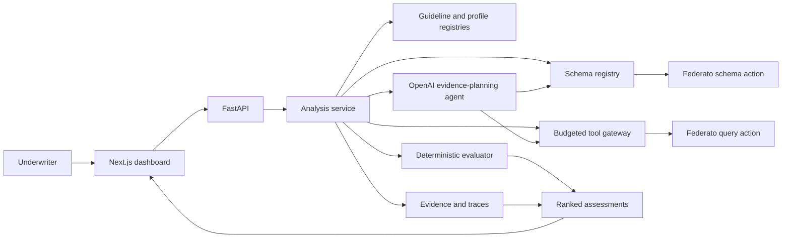

# UnderwriteIQ

UnderwriteIQ is a guidance-agnostic underwriting harness for Hack the North 2026. It runs an explicitly selected, versioned guideline package against the Federato queue, explains every result with source evidence, and surfaces missing or conflicting information instead of guessing.

> Which submissions should an underwriter review first, and why?

UnderwriteIQ does not approve, price, quote, or bind insurance coverage.

## What is implemented

- Federato OAuth client-credentials flow with server-side token caching.
- Live schema discovery, local query validation, and schema-declared relationship traversal.
- A generic guideline contract for scope, facts, sufficiency, rules, ranking, profiles, and tool policy.
- Versioned guideline and investigation-profile registries with explicit package selection.
- An evidence ledger with canonical fact IDs, provenance, retrieval time, source date, state, and non-destructive observations.
- Deterministic guideline evaluation with hard requirements before preferences.
- Generic rule operators, so approved threshold and eligibility changes do not require evaluator code changes.
- `target`, `acceptable`, `needs_review`, and `out_of_appetite` classifications.
- COPE evidence coverage that separates informational factors from carrier decision rules.
- A central tool gateway that validates schema, budgets, timeouts, adapter policy, and trace events.
- OpenAI Responses API agent with strict schema, guideline, and Federato query tools before evaluation.
- An optional Baseten UnderwriteIQ model selector for specialist classification after deterministic evaluation.
- Dynamic schema-grounded query construction with bounded repair and visible OpenAI failures.
- Package-declared scope selection before detailed retrieval, with separate available, in-scope, outside-scope, scope-unknown, and assessed counts.
- Credential-free per-query audits with schema digests, pagination, attribution, usefulness, and failure paths.
- Evidence-grounded AI explanations that cannot override appetite outcomes.
- Stable queue ranking, evidence-backed explanations, and auditable tool traces.
- Responsive Next.js guideline library, explicit run selector, queue, generic ledger, and activity views.
- Deterministic demo mode with 12 representative submissions when credentials are absent.
- Backend tests for rule priority, ambiguity handling, ranking, schema validation, and the API.

## Architecture



OpenAI performs bounded evidence planning and explanation. It cannot override verified rule outcomes.

## Run locally

### Backend

From the repository root:

```bash
python3 -m pip install -r backend/requirements.txt
python3 -m uvicorn backend.main:app --reload --port 8000
```

Without credentials, the API starts in demo mode. API documentation is at [http://localhost:8000/docs](http://localhost:8000/docs).

### Frontend

In another terminal:

```bash
cd frontend
npm install
npm run dev
```

Open [http://localhost:3000](http://localhost:3000). The frontend defaults to `http://localhost:8000`. Copy `frontend/.env.example` to `frontend/.env.local` to change it.

## Live Federato mode

Set credentials only in the backend process environment:

```bash
export FEDERATO_CLIENT_ID="..."
export FEDERATO_CLIENT_SECRET="..."
python3 -m uvicorn backend.main:app --reload --port 8000
```

Never prefix these secrets with `NEXT_PUBLIC_` or place them in the frontend. Other documented defaults are in `.env.example`.

Live mode discovers the schema first, queries only resources found in that schema, validates requests locally, and resolves schema-declared relationships. The live schema remains authoritative for resource names, fields, and references.

## OpenAI underwriting agent

Set the OpenAI key only in the backend environment. Never put it in `frontend/.env.local`, a `NEXT_PUBLIC_` variable, source code, screenshots, or committed files.

```bash
export OPENAI_API_KEY="..."
export OPENAI_MODEL="gpt-5.6-terra"
export OPENAI_REASONING_EFFORT="medium"
python3 -m uvicorn backend.main:app --reload --port 8000
```

Each queue run gives the agent three strict tools:

- `inspect_schema` returns the runtime Federato resources, fields, and references.
- `get_guideline` returns the explicitly selected, versioned decision contract.
- `query_federato` validates and executes model-authored query JSON with bounded pagination.

The model must inspect schema and guideline, name the unresolved fact IDs for each query, issue at least one dynamic query, and return a schema-constrained report. The backend accepts an AI explanation only when its submission and evidence identifiers are verified. If OpenAI, a required adapter, or structured output fails, the run fails without a fallback queue.

The complete design and challenge acceptance matrix are in [AGENT_PLAN.md](AGENT_PLAN.md).

## Appetite logic

The 2025 property rules require new property business in an eligible state, TIV at or below $150M, premium from $50K-$175K, buildings newer than 1990, a majority of acceptable construction, and aggregate applicable five-year losses below $100K.

Target state, TIV, premium, and building age are displayed as a transparent match count, such as `3/4`. They are not presented as an actuarial risk score. Ambiguous boundaries such as exactly 1990, exactly $100K in losses, or a 50/50 construction mix produce `needs_review`.

The first package is [backend/guidelines/guideline-a/package.json](backend/guidelines/guideline-a/package.json). It stores scope, facts, sufficiency, hard requirements, preferences, ranking, profile linkage, and tool policy. The API validates and resolves it at the beginning of every analysis run.

Federato schema discovery controls where evidence is retrieved. The appetite file controls how that evidence is evaluated. A data schema does not define carrier underwriting policy.

## API

- `GET /api/health`
- `GET /api/schema/status`
- `GET /api/guidelines`
- `GET /api/guidelines/{guideline_id}`
- `GET /api/profiles`
- `GET /api/submissions`
- `POST /api/analysis/batch`
- `GET /api/runs/{run_id}`
- `GET /api/runs/{run_id}/trace`

Omit `submission_ids` or send `null` to analyze the full queue:

```json
{
  "guideline_id": "guideline-a",
  "guideline_version": "2025.1",
  "submission_ids": ["101", "102"],
  "force_schema_refresh": false
}
```

## Checks

```bash
python3 -m pytest backend/tests -q
cd frontend
npm run lint
npm run build
```

Run the credentialed acceptance gate from the repository root:

```bash
./.venv/bin/python scripts/run_guideline_acceptance.py
```

The gate requires live Federato and OpenAI credentials. It independently pages minimal Submission scope evidence, compares the exact expected and assessed ID sets, rejects duplicate, missed, or unrelated assessments, and requires no failed trace event. It writes a credential-free diagnostic artifact to the ignored `artifacts/underwriting-runs/` directory with query audits, traces, ledgers, scoped counts, and the agent stop reason.

## Current limitations

- Live normalization uses schema-aware traversal plus conservative semantic aliases because the challenge does not provide a static field catalog. Verify the first credentialed run against the actual schema and sample records.
- Runs and traces are in memory and reset when the backend restarts.
- Analysis is synchronous and sized for the challenge dataset.
- External enrichment is deferred because Federato marks it optional.
- A real OpenAI run requires a server-side key and network access. Automated tests use a scripted transport so CI never consumes API credits.
- Live acceptance has been verified against the 158-submission Federato challenge dataset; demo mode remains available as a representative schema/query sandbox when credentials are absent.
- Baseten is an optional additional classifier; deterministic hard requirements remain authoritative.
- Construction is TIV-weighted when all per-building values exist; otherwise building count is used and disclosed.

See [MVP.md](MVP.md) for the complete scope and decision record.


### Evidence-search verification

Queue loading first retrieves paginated submission identity and package-declared scope evidence.
Only exact in-scope IDs enter detailed evidence gathering and deterministic assessment; unrelated
business and unknown scope remain separate counts. The agent receives candidate and discovered
relationship IDs, the live schema, selected guideline, unresolved questions, coverage, pagination,
and remaining budget. Each query updates the source graph and ledger before the next search
decision. Final explanations come from deterministic rule outcomes and source citations.
`activity` contains query-focused underwriter events; `trace` retains execution detail.

Run the offline replay fixture without OpenAI or Federato network access:

```sh
.venv/bin/python scripts/smoke_openai_agent.py --fixture
```

The fixture gathers policy and building evidence, then claims. It reports the actual ledger
outcomes before and after the claims query for all 12 demo submissions. This is a replay check,
not proof of live model query selection. Run `scripts/run_guideline_acceptance.py` only after
approval to send derived live underwriting data to OpenAI. It requires all 158 submissions.
