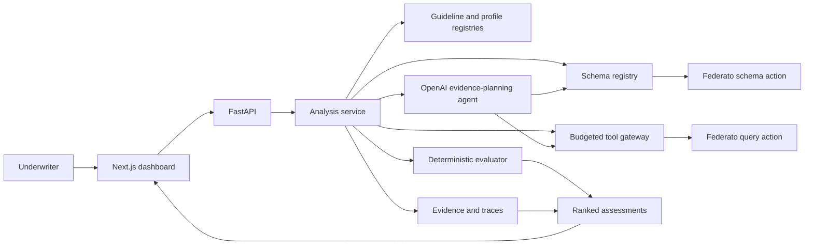

# UnderwriteIQ

UnderwriteIQ is a guidance-agnostic underwriting harness for Hack the North 2026. It runs an explicitly selected, versioned guideline package against the Federato queue, explains every result with source evidence, and surfaces missing or conflicting information instead of guessing.

> Which submissions should an underwriter review first, and why?

UnderwriteIQ does not approve, price, quote, or bind insurance coverage.

## What is implemented

- Federato OAuth client-credentials flow with server-side token caching.
- Live schema discovery, local query validation, and schema-declared relationship traversal.
- A generic guideline contract for scope, facts, sufficiency, rules, ranking, profiles, and tool policy.
- Versioned guideline and investigation-profile registries with explicit package selection.
- An evidence ledger with canonical fact IDs, provenance, retrieval time, source date, state, and non-destructive observations.
- Deterministic guideline evaluation with hard requirements before preferences.
- Generic rule operators, so approved threshold and eligibility changes do not require evaluator code changes.
- `target`, `acceptable`, `needs_review`, and `out_of_appetite` classifications.
- COPE evidence coverage that separates informational factors from carrier decision rules.
- A central tool gateway that validates schema, budgets, timeouts, adapter policy, and trace events.
- OpenAI Responses API agent with strict schema, guideline, and Federato query tools before evaluation.
- An optional Baseten UnderwriteIQ model selector for specialist classification after deterministic evaluation.
- Dynamic schema-grounded query construction with bounded repair and visible OpenAI failures.
- Package-declared scope selection before detailed retrieval, with separate available, in-scope, outside-scope, scope-unknown, and assessed counts.
- Credential-free per-query audits with schema digests, pagination, attribution, usefulness, and failure paths.
- Evidence-grounded AI explanations that cannot override appetite outcomes.
- Stable queue ranking, evidence-backed explanations, and auditable tool traces.
- Responsive Next.js guideline library, explicit run selector, queue, generic ledger, and activity views.
- Demo data with 12 property and 2 fictional auto submissions when Federato credentials are absent. OpenAI analysis still requires an OpenAI key; the replay fixture runs offline.
- Backend tests for rule priority, ambiguity handling, ranking, schema validation, and the API.

## Architecture



OpenAI performs bounded evidence planning and explanation. It cannot override verified rule outcomes.

## Run locally

### Backend

From the repository root:

```bash
python3 -m pip install -r backend/requirements.txt
python3 -m uvicorn backend.main:app --reload --port 8000
```

Without credentials, the API starts in demo mode. API documentation is at [http://localhost:8000/docs](http://localhost:8000/docs).

### Frontend

In another terminal:

```bash
cd frontend
npm install
npm run dev
```

Open [http://localhost:3000](http://localhost:3000). The frontend defaults to `http://localhost:8000`. Copy `frontend/.env.example` to `frontend/.env.local` to change it.

## Live Federato mode

Set credentials only in the backend process environment:

```bash
export FEDERATO_CLIENT_ID="..."
export FEDERATO_CLIENT_SECRET="..."
python3 -m uvicorn backend.main:app --reload --port 8000
```

Never prefix these secrets with `NEXT_PUBLIC_` or place them in the frontend. Other documented defaults are in `.env.example`.

Live mode discovers the schema first, queries only resources found in that schema, validates requests locally, and resolves schema-declared relationships. The live schema remains authoritative for resource names, fields, and references.

## OpenAI underwriting agent

Set the OpenAI key only in the backend environment. Never put it in `frontend/.env.local`, a `NEXT_PUBLIC_` variable, source code, screenshots, or committed files.

```bash
export OPENAI_API_KEY="..."
export OPENAI_MODEL="gpt-5.6-terra"
export OPENAI_REASONING_EFFORT="medium"
python3 -m uvicorn backend.main:app --reload --port 8000
```

Each queue run gives the agent four strict tools:

- `inspect_schema` returns the runtime Federato resources, fields, and references.
- `get_guideline` returns the explicitly selected, versioned decision contract.
- `bind_facts` maps guideline facts to discovered source fields.
- `query_federato` validates and executes model-authored query JSON with bounded pagination.

The model must inspect schema and guideline, name the unresolved fact IDs for each query, issue at least one dynamic query, and return a schema-constrained report. The backend accepts an AI explanation only when its submission and evidence identifiers are verified. Unrecoverable required-source errors and evidence-agent failures fail the run visibly. Repairable query errors are shown as revised searches. After evaluation, a separate no-tools OpenAI call writes 2–3 sentence explanations with a 30-second limit. Invalid evidence IDs or writing failures retain the deterministic explanation; they cannot change status or rank.

The complete design and challenge acceptance matrix are in [AGENT_PLAN.md](AGENT_PLAN.md).

## Appetite logic

The 2025 property rules require new property business in an eligible state, TIV at or below $150M, premium from $50K-$175K, buildings newer than 1990, a majority of acceptable construction, and aggregate applicable five-year losses below $100K.

Target state, TIV, premium, and building age are displayed as a transparent match count, such as `3/4`. They are not presented as an actuarial risk score. Ambiguous boundaries such as exactly 1990, exactly $100K in losses, or a 50/50 construction mix produce `needs_review`.

The first package is [backend/guidelines/guideline-a/package.json](backend/guidelines/guideline-a/package.json). It stores scope, facts, sufficiency, hard requirements, preferences, ranking, profile linkage, and tool policy. The API validates and resolves it at the beginning of every analysis run.

Federato schema discovery controls where evidence is retrieved. The appetite file controls how that evidence is evaluated. A data schema does not define carrier underwriting policy.

## API

- `GET /api/health`
- `GET /api/schema/status`
- `GET /api/guidelines`
- `GET /api/guidelines/{guideline_id}`
- `GET /api/profiles`
- `GET /api/submissions`
- `POST /api/analysis/batch`
- `GET /api/runs/{run_id}`
- `GET /api/runs/{run_id}/trace`

Omit `submission_ids` or send `null` to analyze the full queue:

```json
{
  "guideline_id": "guideline-a",
  "guideline_version": "2025.1",
  "submission_ids": ["101", "102"],
  "force_schema_refresh": false
}
```

## Checks

```bash
python3 -m pytest backend/tests -q
cd frontend
npm run lint
npm run build
```

Run the credentialed acceptance gate from the repository root:

```bash
./.venv/bin/python scripts/run_guideline_acceptance.py
```

The gate requires live Federato and OpenAI credentials. It independently pages minimal Submission scope evidence, compares the exact expected and assessed ID sets, rejects duplicate, missed, or unrelated assessments, and requires no failed trace event. It writes a credential-free diagnostic artifact to the ignored `artifacts/underwriting-runs/` directory with query audits, traces, ledgers, scoped counts, and the agent stop reason.

## Current limitations

- Live normalization uses schema-aware traversal plus conservative semantic aliases because the challenge does not provide a static field catalog. Verify the first credentialed run against the actual schema and sample records.
- Runs and traces are in memory and reset when the backend restarts.
- Analysis is synchronous and sized for the challenge dataset.
- Optional OpenFEMA context counts distinct state disaster declarations over five years. Fewer declarations break ties after target matches and evidence completeness, before date and submission ID. The panel shows the source and actual rank movement. It is state context, not a property flood score or carrier requirement. A failed or incomplete lookup leaves ranking unchanged (10-second total limit).
- A real OpenAI run requires a server-side key and network access. Automated tests use a scripted transport so CI never consumes API credits.
- Scope selection pages the available queue, then assesses only submissions matching the selected guideline. Outside-scope submissions and unknown scope are separate from appetite failures.
- Baseten is an optional additional classifier; deterministic hard requirements remain authoritative.
- Construction is TIV-weighted when all per-building values exist; otherwise building count is used and disclosed.

See [MVP.md](MVP.md) for the complete scope and decision record.


### Evidence-search verification

Queue loading first retrieves paginated submission identity and package-declared scope evidence.
Only exact in-scope IDs enter detailed evidence gathering and deterministic assessment; unrelated
business and unknown scope remain separate counts. The agent receives candidate and discovered
relationship IDs, the live schema, selected guideline, unresolved questions, coverage, pagination,
and remaining budget. Each query updates the source graph and ledger before the next search
decision. Final explanations describe deterministic rule outcomes and source citations; the bounded writing pass cannot change the underlying result.
`activity` contains query-focused underwriter events; `trace` retains execution detail.

Run the offline replay fixture without OpenAI or Federato network access:

```sh
.venv/bin/python scripts/smoke_openai_agent.py --fixture
```

The fixture gathers policy and building evidence, then claims. It reports the actual ledger
outcomes before and after the claims query for the 12 in-scope property submissions (the two auto submissions stay outside scope). This is a replay check,
not proof of live model query selection. Run `scripts/run_guideline_acceptance.py` only after
approval to send derived live underwriting data to OpenAI. It compares exact in-scope IDs, not a hard-coded total of assessments.

### Demo validation findings

- Live schema confirms `Claim.policy`, but no `Submission.policy` or `Building.location`. The saved failed payload selected `claims.policy.id` without expanding that reference. Bare `claims.policy: true` is valid and returns the ID. The query planner now expands nested selections and retains raw relationship IDs; local validation rejects the original invalid payload.
- A targeted `Policy.submission` query returned zero Policy rows for the 11 previously unresolved submissions. No unsupported reverse lookup is attempted. Completed searches that return no Policy are recorded separately from incomplete retrieval. A known failure on another requirement can still put such an account outside appetite.
- An omitted Claim collection is not zero losses. The offline replay demonstrates four real changes from needs review to target/acceptable after Claim evidence arrives.
- Live scope discovery found 20 `auto` submissions. The commercial-auto package is explicitly a sample. Version 2026.2 adds driver accident history, driving-record points, oldest vehicle model year, and operating radius to its premium and loss rules. The agent retrieves these from linked `ExposureUnit` records. It is not the official 2025 property guideline.
- Choose model and guideline before Run. A completed queue opens the first non-empty action group. Elapsed time is shown during the first run; it is not simulated backend progress. Activity contains actual queries, useful evidence changes, explanation coverage, and enrichment results.
- OpenFEMA is a direct bounded public-API lookup after evaluation, outside the Federato tool gateway. It receives state codes, not account identifiers. Dataset: [Disaster Declarations Summaries v2](https://www.fema.gov/openfema-data-page/disaster-declarations-summaries-v2). Distinct disaster numbers avoid counting county rows as separate disasters. Incomplete pagination or API failure discards the enrichment.
- Validation: Python compilation, seven existing schema/demo checks, offline evidence replay, frontend lint, and TypeScript. The existing evaluator suite has a stale `appetite_version` assertion; the model already uses `guideline_version`. No backend tests were added.

### Latest scoped live acceptance — September 20, 2026

`run_8531e310d278` completed in 84.8 seconds: 158 available, 38 in scope, 120 outside scope, 0 scope unknown, and 38 assessed. Results: **0 eligible, 1 needs review, 37 outside appetite**. No duplicate, missed, or unrelated assessments; no failed trace events. Seven audited queries recorded 233 useful fact changes and no unowned or unrelated returned evidence.

Eleven submissions still have no linked Policy in Federato. Headquarters evidence establishes other hard failures for ten of them, so only one remains `needs_review`; 33 Policy-dependent facts remain unresolved across the eleven accounts. Missing Policy records are not filled with invented data.

The final writing pass produced 37 evidence-cited OpenAI explanations in 22.1 seconds. One account retained its deterministic missing-Policy explanation. OpenFEMA returned context for ten states in 0.8 seconds and changed 26 queue positions within existing appetite status groups. These counts are observations from this run, not required or hard-coded outcomes.

The local ignored artifact is `artifacts/underwriting-runs/run_8531e310d278.json`. It records the exact query payloads, evidence ledger, explanation sources, scope reconciliation, trace, and enrichment rank changes. Later code checks also cover preserving bare reference IDs on pagination and handling repairable helper-query errors. The model-call comparison figures elsewhere do not include the separate explanation-writing pass.

### Switching from property to auto

The same evidence agent reads the selected guideline and searches for its missing facts. Property requires building age and construction evidence. The auto sample requires driver and vehicle evidence instead; it does not apply property building rules to vehicles.

The auto sample has these illustrative fleet requirements:

| Fact | Requirement | Source |
| --- | --- | --- |
| Most accidents for one driver in three years | At most 2 | `ExposureUnit.driver.accidents_3yr` |
| Highest driving-record points | At most 6 | `ExposureUnit.driver.mvr_points` |
| Largest operating radius | At most 500 miles | `ExposureUnit.vehicle.radius_miles` |
| Oldest vehicle model year | 2012 or newer | `ExposureUnit.vehicle.year` |

Driver checks use records with `kind: driver`; vehicle checks use `kind: vehicle`. The mapper requires the complete linked exposure collection and the required field on every relevant record. Missing records, missing kinds, or missing values remain unresolved. Sample target preferences include zero driver accidents and an operating radius of at most 200 miles. These thresholds are illustrative, not organizer-supplied carrier rules.

The fictional demo includes one eligible fleet and one fleet with driver and vehicle failures. For live verification:

```sh
.venv/bin/python scripts/run_guideline_acceptance.py --guideline guideline-auto
```

Auto version 2026.2 was verified live in `run_d3663ee78695` on September 20, 2026. It selected exactly 20 auto submissions from 158 available and completed in 60.7 seconds with no failed trace events, duplicate assessments, missed candidates, or unrelated evidence. The model selected a Policy query expanding `exposure_units`, including driver accidents/points and vehicle radius/year. All four fleet facts were verified for the 14 submissions with linked Policies. The six without Policies remained unresolved. Submission results were 14 outside appetite and 6 needs review; account-group totals in the UI can be smaller.

A concrete example is submission 6, Redline Logistics: the evidence showed 9 driver record points against the sample maximum of 6 and a 1,000-mile operating radius against the sample maximum of 500 miles. The explanation cited those fleet failures alongside the renewal requirement. Fourteen explanations were model-written; the six missing-Policy submissions retained deterministic explanations. This demonstrates different evidence retrieval under the same agent, not a promise that the sample guideline will produce eligible accounts.
